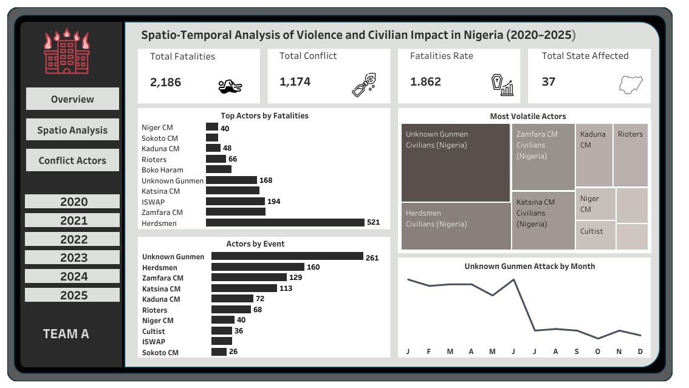

# Spatio-Temporal Analysis of Conflict and Civilian Impact in Nigeria (2020–2025)

---
## Table of Contents
- [Introduction](#introduction)
- [Problem Statement](#problem-statement)
- [Tools Used](#tools-used)
- [Skills Demonstrated](#skills-demonstrated)
- [Data Sourcing](#data-sourcing)
- [Data Transformation](#data-transformation)
- [Visualization and Analysis](#visualization-and-analysis)
- [Key Findings](#key-findings)
- [Recommendations](#recommendations)

---

## Introduction

This project analyzes spatio-temporal conflict data in Nigeria between 2020 and 2025 to uncover trends, hotspots, and actors driving violence. The study leverages data analytics and visualization to provide actionable insights for policymakers, NGOs, and security agencies.

---

## Problem Statement

Nigeria has experienced persistent violent conflicts ranging from insurgency and communal clashes to political violence. Identifying where, when, and who is driving these events is critical for security planning, humanitarian response, and peacebuilding efforts.

This project aims to answer:
- How has violence evolved across time (2020–2025)?
- Which states and regions are most affected?
- Who are the key actors driving these conflicts?
- What are the fatality trends, and do they align with the number of events?
---
## Tools Used

-	Excel
-	Tableau (Interactive Dashboard)
---
## Skills Demonstrated

-	Data Cleaning
-	Filtering
-	Geospatial Visualization (Tableau Maps)
-	Page navigation
-	Calculated Field
-	Tooltip and button
-	Grouping in categorical columns
---
## Data Sourcing

The Dataset was downloaded from Armed Conflict Location & Event Data (ACLED) website.

It covers conflict-related events from all over the world from 1997 to July 2025. It has 420379 rows and 27 columns.

---

## Data Transformation

Steps taken to prepare the dataset:
-	The country column was filtered to get conflicts related to Nigeria only
-	The year column was filtered to get conflicts between 2020 and 2025
-	Admin3 and disorder_type columns was deleted
-	Columns renamed are event_type and sub_event_type to conflict category and conflict category type, respectively.
-	Event_dates was changed from date/time formats to date format
-	Created a calculated column called Fatalities rate
-	Inconsistent data in different columns was corrected

---

## Visualization and Analysis

The report contains three pages:
1. Overview
2. Spatio Analysis
3. Conflict Actors

You can interact with the dashboard [here](https://public.tableau.com/app/profile/rasaq.kareem/viz/HTAFinalProject/Overview)
### Overview

- Nigeria witnessed 1,174 violent incidents resulting in 2,186 deaths, with an average of nearly two fatalities per conflict. 
- Violence against civilians was the most lethal and frequent category, accounting for the majority of both incidents and deaths. 
- Conflict spread across 37 states, underscoring its nationwide reach, though fatalities peaked sharply in May and June, suggesting seasonal or event-driven escalations.

### Spatio Analysis

- Violence was heavily concentrated in specific hotspots, with Zamfara, Borno, and Benue recording the highest fatalities
- Most conflict events were mapped with exact geolocation, ensuring the reliability of the analysis.
- The North-Central and North-West regions emerged as the deadliest zones, reflecting persistent farmer-herder clashes, banditry, and insurgency.

### Conflict Actors

- Herdsmen caused the highest fatalities, followed by ISWAP and unknown gunmen.
- Unknown gunmen carried out the most attacks, with herdsmen and Zamfara CM also being major instigators.
- Civilians were the most affected, especially by herdsmen and unknown gunmen.
- Attacks by unknown gunmen peaked mid-year and declined towards the end of the year.
---

## Key Findings

- **High Civilian Fatalities**: Civilians are the most affected group, experiencing the highest number of deaths.

- **Deadliest Conflict Types**: Violence against civilians and battles between armed groups remain the most frequent and deadly forms of conflict.

- **Regional Hotspots**: Borno, Zamfara, Kaduna, Katsina, and Benue recorded the highest concentration of violent events and fatalities, making them key conflict hotspots.

- **Seasonal Spikes**: Fatalities peaked during May–July, suggesting seasonal factors such as farmer–herder clashes and political activities intensify violence.

- **Perpetrators of Violence**: Herdsmen and unknown gunmen are among the deadliest conflict actors, driving a significant share of fatalities.

## Recommendations

- **Strengthen Security in Hotspots**:Deploy coordinated security forces and intelligence-driven policing in high-risk states such as Zamfara, Benue, Borno, Kaduna, and Katsina to curb insurgency, banditry, and communal clashes.

- **Community-Based Peacebuilding**: Promote farmer–herder dialogue platforms, strengthen community policing, and establish early-warning systems to protect civilians, who are the most vulnerable group.

- **Seasonal Conflict Preparedness**: Intensify patrols, surveillance, and mediation efforts during high-risk months (May–July), when attacks by unknown gunmen and communal militias usually peak.

- **Tackle Root Socio-Economic Drivers**: Reduce recruitment into violent groups by investing in education, job creation, and rural development, especially targeting unemployed youths in conflict-prone regions.

- **Enhance State–Federal Collaboration**: Encourage partnerships among federal security agencies, local governments, and vigilante/community groups for rapid response and improved trust with residents.

- **Adopt Data-Driven Policies**: Continuously monitor conflict trends through geospatial mapping and transparent reporting to guide resource allocation and adapt strategies to evolving dynamics.
